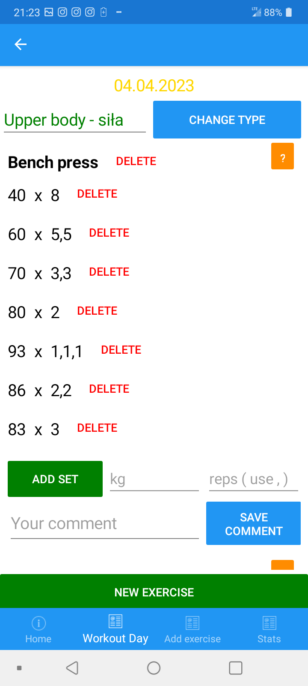

# WorkoutMaster
It is an application for people who workout in a gym. It allows you
to create a workout day and add exercises to it. While adding exercise
You can add sets, reps, and comments.

## Main features
* Creating a workout day (one per day)
* Changing exercise type on certain workout day
* Adding exercise to certain workout day
* Adding sets, reps, and comments to exercises on certain workout days
* Ability to see all sets, reps, and comments for certain exercise for all workout days by workout day type
* Adding new exercises and their descriptions
* Adding new exercise types and their descriptions

## Screenshots
* Home tab, there are all of your workout days

* After selecting a certain workout day (or if you create a new one)

* After clicking on "edit" in workout day

* After clicking on "change type" in workout day -> edit

* After clicking on the "new exercise" in workout day -> edit

* After clicking on "?" in certain exercise in workout day -> edit (you see all sets and reps for that exercise in selected workout type)

* After clicking on Add Exercise tab

* After clicking on "Add New Exercise" in Add Exercise

* After clicking on "Add New Exercise Type" in Add Exercise

* ERD
